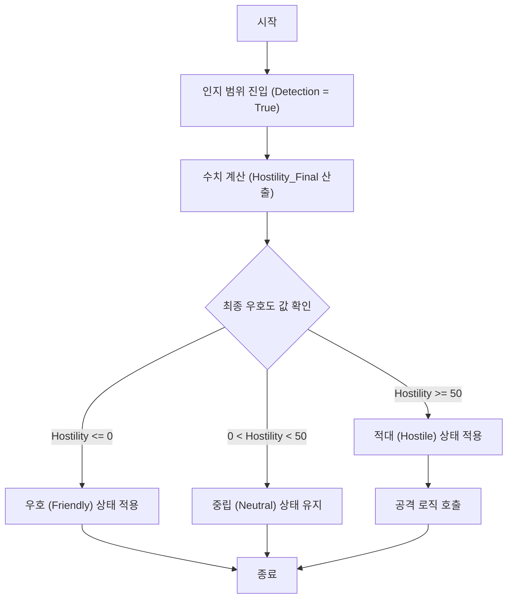
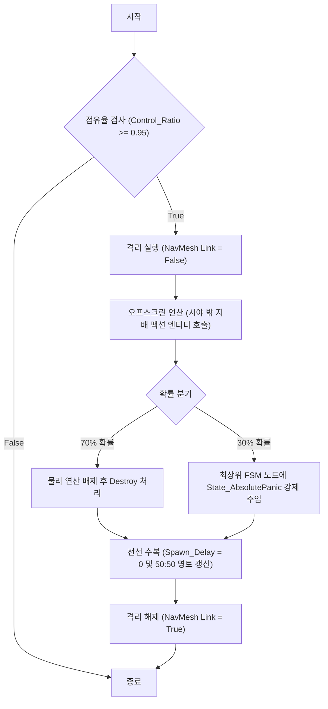

# 1. 팩션 생태계 AI 시스템 구조도

## 1.1. AI 구조도

팩션 AI는 백그라운드에서 수치를 계산하는 '내부 연산'과, 계산된 결과에 따라 실제 개체의 행동을 제어하는 'FSM / BT'로 분리되어 작동합니다.

| 내부 연산 | 상태 머신 및 행동 제어 |
| --- | --- |
| **우호도 연산** | **Friendly (우호)** : 버프 제공 / 아군 참전 |
| **알파 사망 연산** | **Neutral (중립)** : 기본 루틴 (순찰, 대기, 수면) |
| **금기 감지 연산** | **Hostile (적대)** : 추적 (감정형 / 목적형 / 왜곡형) |
| **자정 임계치 연산** | **Absolute Panic (자아 붕괴)** : 무장 해제 / 아군 오사 |

## 1.2. 내부 연산 정의

1. 비헤이비어 트리 안에서도 내부 연산을 호출해서 실행될 수 있으며, 환경 트리거에 의해 독립적으로도 실행됩니다.

* **[우호도 연산]**
* 몬스터의 인지 범위 내에 플레이어가 진입했을 때 실행되는 연산이다.
* 플레이어의 스탯(왜곡도)을 기반으로 적대 수치를 연산하고 FSM 상태 전환 여부를 판단한다.

* **[알파 사망 연산]**
* 피격 연산에서 룸 내의 리더 개체 HP가 0 이하가 되면 호출되는 연산이다.
* 해당 룸에 속한 하위 개체들의 상태를 강제로 [Intimidated(위압)] 상태로 전환하는 처리를 담당한다.

* **[자정 임계치 연산]**
* 특정 팩션의 맵 점유율(`Control_Ratio`)을 상시 검사하는 연산이다.
* 점유율이 95% 이상일 경우, 대규모 오프스크린 엔티티 파괴 및 스폰 연산을 실행한다.

---

# 2. 내부 연산 상세 플로우

## 2.1. 내부 연산 - 우호도 연산 플로우

    

### 2.1.1. 우호도 연산

* 토착 몬스터가 플레이어 객체와 조우(SphereCollider 충돌 발생)하면 호출되는 연산이다.

### 2.1.2. 우호도 연산 설명

1. **최종 우호도 산출식을 확인한다.**
* $Hostility_{Final} = Base_{Hostility} + (Distortion_{Player} \times K_{Modifier}) - Faction_{Affinity}$
* 플레이어의 왜곡도($Distortion_{Player}$)와 팩션 친밀도($Faction_{Affinity}$)를 대입하여 수치를 산출한다.

2. **산출된 수치에 따라 FSM 상태를 판단한다.**
* **2.1.** 산출된 수치가 0 이하($Hostility_{Final} \le 0$)라면, [Friendly = True]를 반환하고 아군 지원 로직을 호출한다.
* **2.2.** 산출된 수치가 0 초과 50 미만($0 < Hostility_{Final} < 50$)이라면, [Neutral = True]를 반환하고 기존 루틴 노드를 유지한다.
* **2.3.** 산출된 수치가 50 이상($Hostility_{Final} \ge 50$)이라면, [Hostile = True]를 반환하고 즉시 전투 태세 및 주변 개체 어그로 브로드캐스트를 실행한다.

---

## 3. 내부 연산 상세 - 맵 자정 작용(초기화) 플로우

    
### 3.1.1. 자정 작용 연산

* 특정 세력이 맵을 과도하게 독점하여 시스템적 임계치를 넘었을 때, 프레임 드랍 없이 생태계를 강제 리셋하기 위해 호출되는 비동기 연산이다.

### 3.1.2. 자정 작용 연산 설명

1. **지배 세력의 점유율이 95%(`Control_Ratio >= 0.95`) 이상인지 확인한다.**
* **1.1.** 95% 미만[False]이라면 연산을 종료한다.
* **1.2.** 95% 이상[True]이라면 60초의 유예 시간 후 자정 작용 이벤트를 호출한다.

2. **물리 연산 부하를 막기 위해 플레이어 격리를 실행한다.**
* **2.1.** 플레이어가 위치한 룸의 `NavMesh Link`를 비활성화(False)하여 다른 구역의 데이터 초기화 연산에 간섭하지 못하도록 차단한다.

3. **오프스크린(시야 밖) 엔티티에 대한 데이터 조작을 실행한다.**
* **3.1.** 렌더링되지 않는 구역의 지배 세력 엔티티 배열을 순회하며 무작위 70%는 `Destroy()` 함수로 삭제한다.
* **3.2.** 남은 30%의 개체는 FSM에 [Absolute Panic] 상태를 주입하여 무장 해제 및 피아 식별 불가 상태로 만든다.
